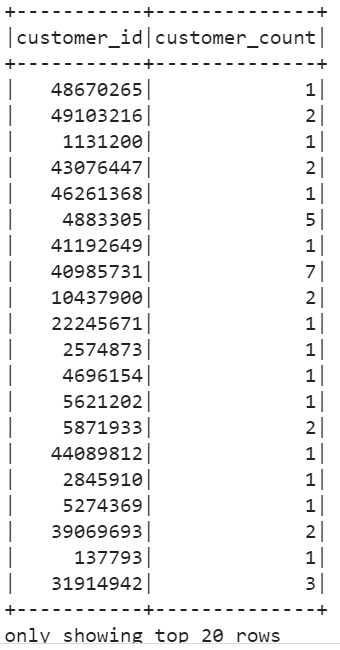
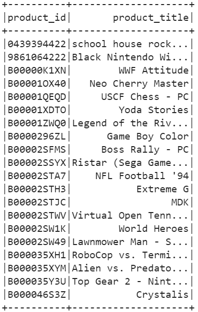
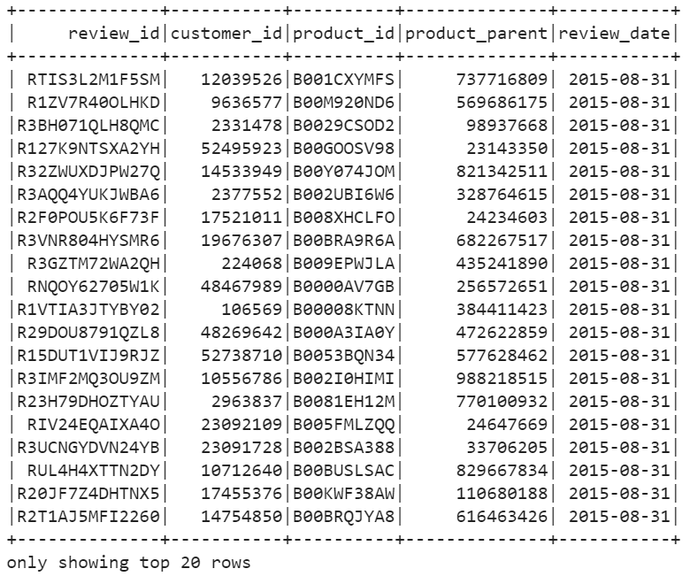
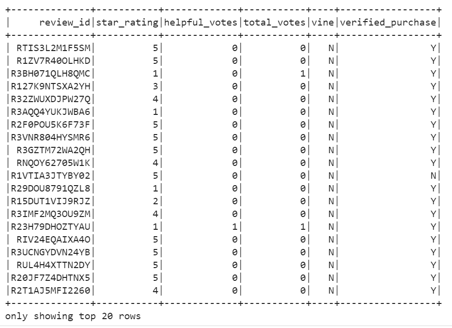

# Amazon_Vine_Analysis

## Project Overview
The Amazon Vine program is a service that allows manufacturers and publishers to receive reviews for their products. Companies like SellBy pay a small fee to Amazon and provide products to Amazon Vine members, who are then required to publish a review.

In this project, reviews pertaining to video games were examined. Using PySpark and the extract, transform, load (ETL) process, the dataset was extracted, transformed, connected to AWS RDS instance, and the transformed data was loaded into pgAdmin.

Next, PySpark was used to determine if there was any bias towards favorable reviews from Vine members in the data provided.

## Resources

- AWS- RDS, S3
- Python- PySpark
- Google Colaboratory
- Jupyter Notebook
- pgAdmin 4
- Data- [Amazon Video Game Dataset](https://s3.amazonaws.com/amazon-reviews-pds/tsv/amazon_reviews_us_Video_Games_v1_00.tsv.gz)

## Analysis
First, an AWS RDS database was created with tables in pgAdmin. I chose to use the videogame dataset for this analysis.

The sataset was first extracted into a DataFrame. From there, it was transformed into four separate DataFrames that match the table schema in pgAdmin, which can be viewed [here](https://github.com/k-wrenn/Amazon_Vine_Analysis/blob/master/challenge_schema.sql). The transformed data was upoaded into the appropriate tables and queries were run in pgAdmin to confirm.

The first dataframe created was the
one which held all the data within the dataset. This included 15 sparate columns

Next, a different dataframe was created that matched each of the table schema in pgAdmin.

The first dataframe created was the customers_df dataframe. This dataframe included two colums, customer_id and customer_count. 

Then a products_df dataframe was created using product_id and product_title as columns. Duplicates product_id were dropped using **.drop_duplicates(["product_id"])** 

A review_id_df dataframe was created. For this dataframe, review_id, customer_id, product_id, product_parent, and review_date were used for columns. 

Lastly, a vine_df dataframe was made using review_id, star_rating, helpful_votes, total_votes, vine, and verified purchase as column headers. 

This last dataframe will be the one we use for our analysis to determine if having a paid Vine review makes a difference in the percentage of 5-star reviews.

Once the dataframes were generated, we then connected to the AWS RDS instance and wrote each DataFrame to its table in pgAdmin.

To determine if there was any bias towards favorable reviews from Vine members, the vine_df was filtered to create an additional dataframes.

First, the data was filtered to create a new dataframe where the total_votes count is greater than or equal to 20. This was done to pick reviews that are more likely to be helpful and to avoid having division by zero errors. 

That dataframe was further filtered down to retrieve all rows where the number of helpful_votes divided by the total_votes is greated than or equal to 50%.

The second dataframe was then filtered to retrieve all the rows where the review was written as a part of the Vine program. Another dataframe was also created to retrieve rows that were not a part of the Vine program.

Images of the filtered data can be found [here](https://github.com/k-wrenn/Amazon_Vine_Analysis/tree/master/Images/Filtered_df)

## Results

Once all the above dataframes were created, the total number of reviews, the number of 5-star reviews, and the percentage of 5-star reviews for both paid and unpaid were determined. Below are the results:
- Total number of helpful reviews: 40,565
- Total number of paid reviews: 94
- Total number of 5-star paid reviews: 48
- Percentage of 5-star paid reviews: 51.1%
- Total number of unpaid reviews: 40, 471
- Total number of 5-star unpaid reviews: 15, 663
- Percentage of 5-star unpaid reviews: 38.7%

## Summary
The above numbers show the Vine system makes up a small amount of the total number reviews (94 out of 40,565); however, of those paid reviews, 51.1% of them were 5-star ratings. Conversely, 15,663 of the 40,471 unpaid reviews were 5-star ratings, or 38.7%.

It seems that the Vine system has a positive bias towards 5-star reviews of video games. Due to the much larger number of non-vine reviews versus Vine reviews, a stastical analysis, suchas a t-test, could be done to analyze a null hypothesis of "the mean rating (in number of stars) of Vine reviews is the same as the mean rating (in number of stars) of non-vine reviews."

The calculated p-value would determine whether or not there is sufficient evidence to reject the aforementioned null hypothesis which would, in turn, determine if the means are statistically similiar or if there is in fact bias towards favorable ratings from Vine users.
